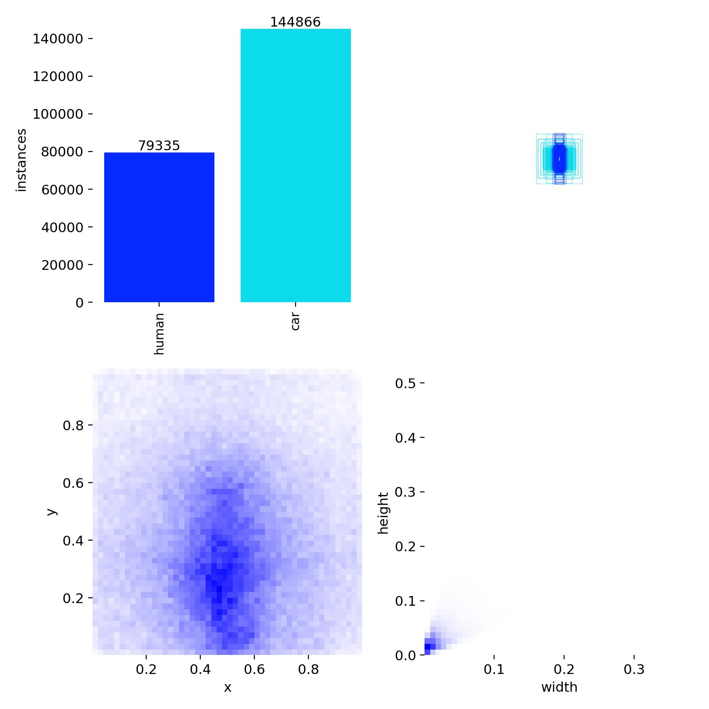
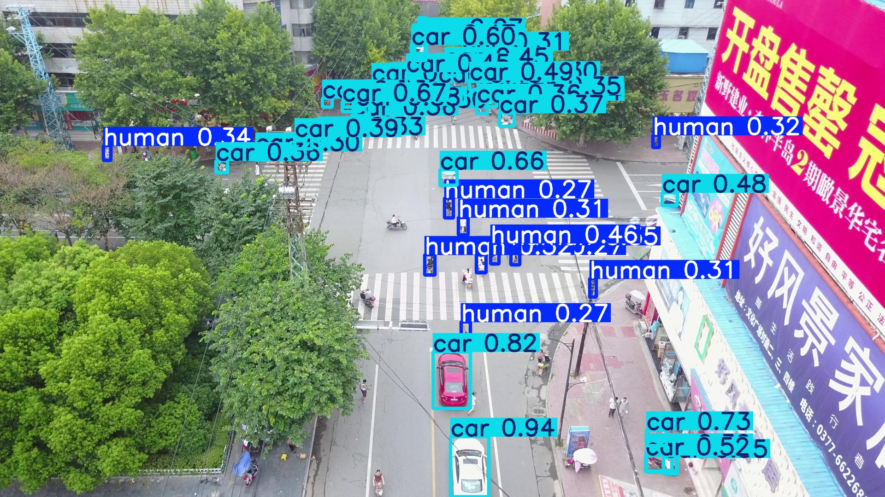
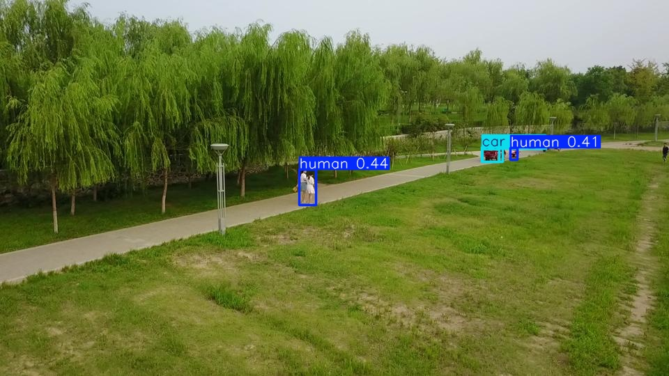
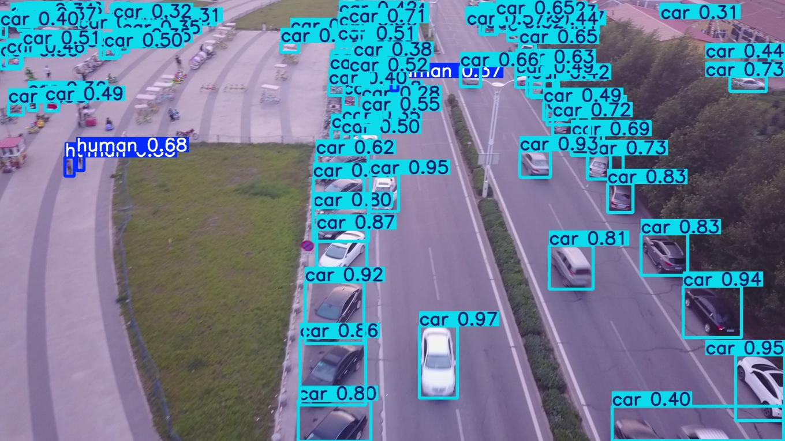
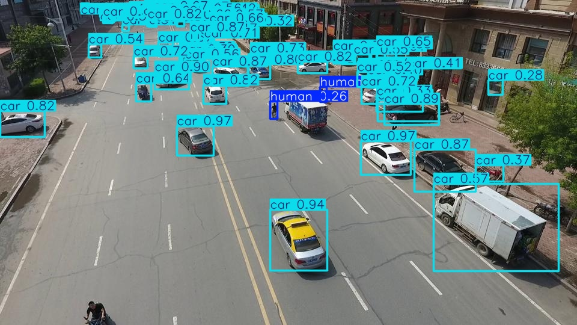

# Drone Human Detection & Counting System

## Overview

This project was developed for the Antlings AI/ML Technical Assessment.

The system detects:
- Humans
- Cars

from drone/aerial imagery using YOLOv8.

It also:
- Counts total humans
- Visualizes detections
- Displays confidence scores
- Saves processed outputs

---

# Model Used

- YOLOv8 Nano (YOLOv8n)

---

# Dataset

VisDrone Dataset:  
https://www.kaggle.com/datasets/banuprasadb/visdrone-dataset

---

# Features

-> Human Detection  
-> Car Detection  
-> Human Counting  
-> Bounding Box Visualization  
-> Confidence Score Display  
-> Processed Output Saving  

---

# Training Details

- Epochs: 20
- Image Size: 640
- Batch Size: 16
- GPU: Tesla T4

---

# Results

## Validation Metrics

- mAP50: ~0.51
- Human Detection mAP50: ~0.30
- Car Detection mAP50: ~0.71

---

# Challenges Faced

- Small object detection
- Dense crowd regions
- Occlusion
- Scale variation
- Drone viewpoint complexity

---

# Run Inference

```bash
python detect_count.py \
    --model weights/best.pt \
    --image sample.jpg \
    --output result.jpg
```

---

# Project Structure

```text
Drone_Detection_Project/
│
├── detect_count.py
├── README.md
├── weights/
│   └── best.pt
│
├── results/
│   └── labels.jpg
│
├── sample_outputs/
│   ├── 0000001_03999_d_0000007.jpg
│   ├── 0000021_00800_d_0000003.jpg
│   └── ...
```

---

# Training Visualization

## Dataset Labels Distribution



---

# Sample Outputs

## Output 1



---

## Output 2



---

## Output 3



---

## Output 4



---


